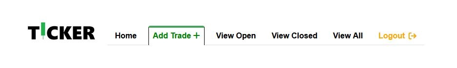

# Ticker

## Table of Contents

* [Introduction](#introduction)
* [Features](#features)
* [Design](#design)
* [User Stories](#user-stories)
* [Bugs](#bugs)
* [Manual Testing](#manual-testing)
* [Deployment](#deployment)
* [Technologies Used](#technologies-used)
* [Credits](#credits)
* [Acknowledgements](#acknowledgements)
 
 
 

<!-- Introduction Section is below, with a 'Back to Top' anchor link, the link will be shown at the bottom of every section -->
## Introduction

Ticker is the 4th project deliverable as part of the Code Institute Diploma in Full Stack Software Development.
  
It is a lightweight stock trading companion application that is designed to assist stock traders track their activity over time and provide a central repository for all trades across multiple brokers. The application has been built using the Django python framework for the primary functionality, it uses ElephantSQL for database storage, HTML5 for the site structure and the Bootstrap framework for CSS and Javascript components. The overall design followed user centric design principles and the mobile first design philosophy, it also focused on providing user friendly CRUD operations across the site. It should be noted that the project has been deployed as a minimum viable product, additional functionality and enhancements will be included in future updates.
  
Ticker is aimed at novice, beginner or hobbyist stock traders that require a central repository to keep track of their trades that have been placed across different brokerages, with the goal of providing this audience with a helpful, lightweight and easy to use solution that will retain their information in a persistent location and provide them with insights into their activity over time. 
  
The deployed site can be found [here](https://ticker-aefd70a6f705.herokuapp.com/).

[Back to Top](#ticker)
 
 
 

<!-------------------------------------------------------------------------------------------------------------------------------------------------------------------------------------------------------------------------------- FEATURES SECTION -->
## Features 

An overview of the key features that have been implemented for this project is shown below, along with several features that will be implemented in future updates.
 

  
 <b>Existing Features</b> 

<!-- Feature 1 begins -->
 
<table>
<tr><th> <b> Customised Logo</b></th></tr>
<tr>
<td>
 
A custom logo has been designed for Ticker, the logo is simple and clear. It also includes a green 'candlestick' symbol that will be instantly recognisable to the target audience and aims communicate the intended use of the application.
  
</td>
</tr>
<tr><td Colspan="2">

</td></tr>
</table>
<!-- Feature 1 ends -->
 
<table>
<tr><th> <b>User Log In and Registration</b> </th></tr>
<tr><td>
 
The application offers user registration and log in functionality using Django's allauth package.
  
</td></tr>
<tr><td Colspan="2">

.webp)

</td></tr>

<tr><td>
 
A notification is also disaplyed to the user alerting them to their log in status.
  
</td></tr>
<tr><td Colspan="2">

.webp)

</td></tr>
</table>

<!-- spacer -->

 
<table>
<tr><th> <b>Site Navbar</b> </th></tr>
<tr><td>
 
A simple, easy to use Navbar has been implemented for the site, utilising Bootstraps CSS and Javascript components, along with some custom styling.
  
</td></tr>
<tr><td Colspan="2"  align="center">

</td></tr>
</table>

<!-- spacer -->

 
<table>
<tr><th> <b>Add Trade</b> </th></tr>
<tr><td>
 
Ticker allows user to add the details of their trades to the database by clicking on the 'Add Trade' button.
  
</td></tr>
<tr><td Colspan="2" align="center">

.webp)

</td></tr>

<tr><td>
 
A form is then displayed to the user allowing them to enter the details relevant for their trade. This form also includes validation according to the specific fields being populated. It also makes use of the Django Money package to allow the data model to correctly perform the calculations related to money.
 
To note, the date field must be populated in the format YYYY-MM-DD or else the form submission will fail and the form will be reset and redisplayed to the user.
  
</td></tr>
<tr><td Colspan="2" align="center">

.webp)

</td></tr>

<tr><td>
 
A confirmation will be disaplyed to the user once the details have been successfully added to the database.
  
</td></tr>
<tr><td Colspan="2" align="center">

.webp)

</td></tr>
</table>

<!-- spacer -->

 
<table>
<tr><th> <b>View Open Trades</b> </th></tr>
<tr><td>
The user can view all open trades on their Ticker account by clicking on the 'View Open' button.
</td></tr>
<tr><td Colspan="2" align="center">

.webp)

</td></tr>

<tr><td>
All open trades currently available on the user's account will then be displayed in tabular form (utilising Bootstraps CSS and Javascript responsive components).
</td></tr>
<tr><td Colspan="2" align="center">

.webp)

</td></tr>
</table>  

<!-- spacer -->
 
<table>
<tr><th Colspan="2"> <b>VAR Assist</b> </th></tr>
<tr><td Colspan="2">
The VAR Assist feature will allow the user to remove two incorrect choices from the screen. When activated, a function will be invoked that replaces the inner HTML of the incorrect choices with 'Offside!', the radio inputs will also be disabled for these choices. The user will be granted 3 VAR Assists at the start of the quiz, and can use 1 per question until they run out.
</td></tr>
<tr><td> <i>Before Use</i> </td><td> <i>After Use</i> </td></tr>

<tr>
<td>

</td>
<td>

</td>
</tr>
</table>  
<!-- spacer -->
 
<table>
<tr><th> <b>Goals Scored</b> </th></tr>
<tr><td>
A tracker will be visible on the bottom right hand corner of the screen during the quiz that will display the 'Goals Scored' by the user.
</td></tr>
<tr><td Colspan="2">

  

</td></tr>
</table>  
<!-- spacer -->
 
<table>
<tr><th> <b>On Hover Changes</b> </th></tr>
<tr><td>
Any items on the screen that the user can interact with will display a subtle colour change on the box shadow when hovered over to convey that the item can be interacted with by tapping or clicking on it.
</td></tr>
<tr><td Colspan="2">

</td></tr>
</table>
<!-- spacer -->
 
<table>
<tr><th Colspan="2"> <b>Answer Feedback</b> </th></tr>
<tr><td Colspan="2">
The Answer Feedback feature provides the user with instant feedback after submitting their answers. An image depicting players in various stages of celebration or desolation are displayed to the user along with a 'MISS!' or 'GOAL!' text caption. 
</td></tr>
<tr><td> <i>Miss!</i> </td><td> <i>Goal!</i> </td></tr>

<tr>
<td>

</td>
<td>

</td>
</tr>
</table>  
<!-- spacer -->
 
<table>
<tr><th> <b>No Option Selected Alert</b> </th></tr>
<tr><td>
The No Option Selected Alert feature provides the user with prominent and immediate feedback if they attempt to answer a question without selecting a choice first. This alert will stay on screen for the duration of the current question being asked, and will be removed automatically for the next question.
</td></tr>
<tr><td>

</td></tr>
</table>  
<!-- spacer -->

[Back to Features](#features)
 
 
 

<!-- The Existing Features section ends here -->
<!-- The Future Features section is shown below, this will be disaplyed in a collapsible format, with each item shown in tabular form -->

  
 <b>Future Features</b>

 
<!-- Future Feature 1 begins -->
<table>
<tr><th><b>Substitution</b></th></tr>
<tr><td>
This feature will allow the user to swap out the question and choice set displayed on screen for another set, this may provide them with a question that they may be able to answer instead. This would possibly involve adding a new 'Substitutes' property to the quizEngine object that would contain the alternative questions and choices values, a function would then change the inner HTML of the containers accordingly once called.
</td></tr>
</table>
<!-- Future Feature 1 ends -->
 
<table>
<tr><th><b>Match Timer</b></th></tr>
<tr><td>
This feature will add a timer to the quiz with a time limit of perhaps 11 minutes, with subtle on screen hints at different checkpoints (e.g "half-time approaching", "approaching the final minute", "we're in injury time"). This would run 'asynchronously' and when it reaches 'full-time', the quiz would end regardless of the user's progression.
</td></tr>
</table>
<!-- spacer -->
 
<table>
<tr><th><b>Home or Away Kit Toggle</b></th></tr>
<tr><td>
This will toggle the colour scheme of the quiz to dark or light modes which will enhance the user experience and aid accessibility.
</td></tr>
</table>
 
<!-- spacer -->
<table>
<tr><th><b>Bonus Facts</b></th></tr>
<tr><td>
Initially I wanted to include bonus facts containing bite size pieces of information about the tournament and women's football in general, these would have been displayed in the container along with the 'GOAL!' or 'MISS!' feedback. It will be added in a future update instead.
</td></tr>
</table>
<!-- spacer -->
 
<table>
<tr><th><b>Hall of Fame</b></th></tr>
<tr><td>
This feature will create a leaderboard to store user scores, adding a competitive dimension to the quiz and perhaps promote sharing, replayibilty and increase enjoyment.
</td></tr>
</table>
<!-- spacer -->
 
<table>
<tr><th><b>Custom Radio Inputs</b></th></tr>
<tr><td>
The project has been deployed with standard/default radio inputs, however these will have customised styling in a future update.
</td></tr>
</table>

[Back to Features](#features)
 
 
 

<!-- Future Features ends here -->

[Back to Top](#fifa-2023-womens-world-cup-quiz)
 
 
 
<!-- Features ends here -->