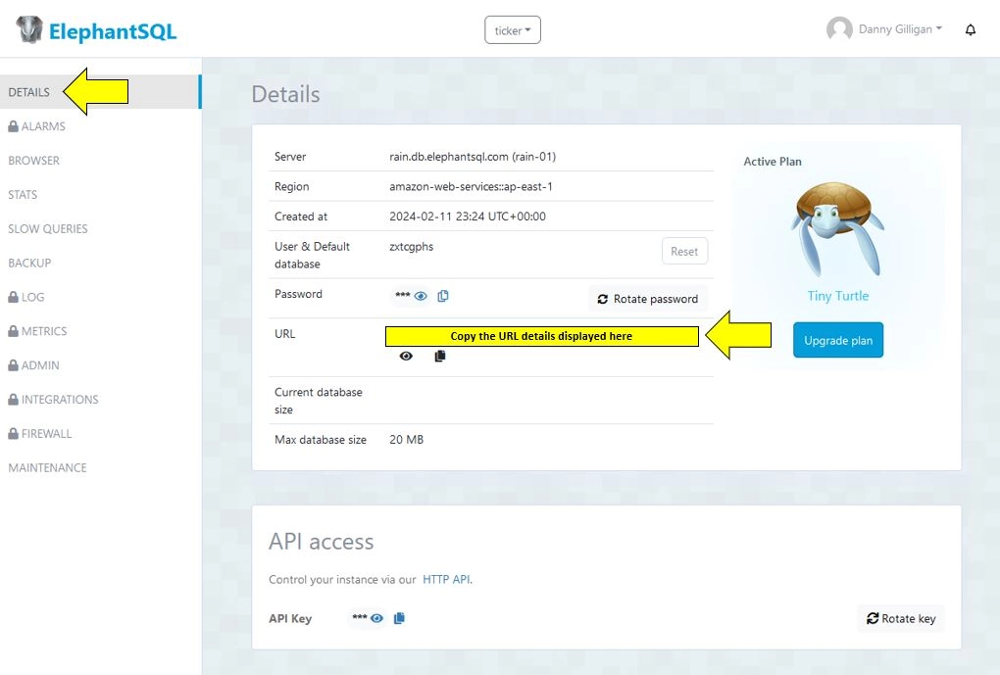

# Ticker

 
## Table of Contents

* [Introduction](#introduction)
* [Design](#design)
* [Features](#features)
* [User Stories](#user-stories)
* [Bugs](#bugs)
* [Manual Testing](#manual-testing)
* [Deployment](#deployment)
* [Technologies Used](#technologies-used)
* [Credits](#credits)
* [Acknowledgements](#acknowledgements)
 
 
 

<!-- Introduction Section is below, with a 'Back to Top' anchor link, the link will be shown at the bottom of every section -->
## Introduction

Ticker is the 4th project deliverable as part of the Code Institute Diploma in Full Stack Software Development.
  
It is a lightweight stock trading companion application that is designed to assist stock traders track their activity over time and provide a central repository for all trades across multiple brokers. The application has been built using the Django python framework for the primary functionality, it uses ElephantSQL for database storage, HTML5 for the site structure and the Bootstrap framework for CSS and Javascript components. The overall design followed user centric design principles and the mobile first design philosophy, it also focused on providing user friendly CRUD operations across the site. It should be noted that the project has been deployed as a minimum viable product, additional functionality and enhancements will be included in future updates.
  
Ticker is aimed at novice, beginner or hobbyist stock traders that require a central repository to keep track of their trades that have been placed across different brokerages, with the goal of providing this audience with a helpful, lightweight and easy to use solution that will retain their information in a persistent location and provide them with insights into their activity over time. 
  
The deployed site can be found [here](https://ticker-aefd70a6f705.herokuapp.com/).

[Back to Top](#ticker)
 
 
 

<!--------------------------------------------------------------------------------------------------------------------------------------------------------------------------------------------------------------------------------- DESIGN SECTION -->
## Design 

An overview of the key design aspects is included below.

  
<b>Colour Scheme </b>

 
The colours used throughout the application were chosen with the intention to enhance accessibility and offer clear presentation of the content displayed to the user, while still maintaining visual interest.
  
<table>
<tr><th>Colour Scheme</th></tr>

<tr><td>

</td>
</tr>
</table>

<!-- Colour Scheme section ends here -->

  
<b>Wireframes </b>

 

  
 <b>Registration</b>

 
<table>

<tr>
<td>

.webp)

</td>
</tr>

<tr>
<td>

.webp)

</td>
</tr>

<tr>
<td>

.webp)

</td>
</tr>

</table>

  
 <b>Login</b>

 
<table>

<tr>
<td>

.webp)

</td>
</tr>

<tr>
<td>

.webp)

</td>
</tr>

<tr>
<td>

.webp)

</td>
</tr>

</table>

  
 <b>Add Trade</b>

 
<table>

<tr>
<td>

.webp)

</td>
</tr>

<tr>
<td>

.webp)

</td>
</tr>

<tr>
<td>

.webp)

</td>
</tr>

</table>

  
 <b>View Trade</b>

 
<table>

<tr>
<td>

.webp)

</td>
</tr>

<tr>
<td>

.webp)

</td>
</tr>

<tr>
<td>

.webp)

</td>
</tr>

</table>

  
 <b>Edit Trade</b>

 
<table>

<tr>
<td>

.webp)

</td>
</tr>

<tr>
<td>

.webp)

</td>
</tr>

<tr>
<td>

.webp)

</td>
</tr>

<tr>
<td>

.webp)

</td>
</tr>

<tr>
<td>

.webp)

</td>
</tr>

</table>

  
 <b>Delete Trade</b>

 
<table>

<tr>
<td>

.webp)

</td>
</tr>

<tr>
<td>

.webp)

</td>
</tr>

<tr>
<td>

.webp)

</td>
</tr>

<tr>
<td>

.webp)

</td>
</tr>

</table>

 

  
<b>Trade Model ERD </b>

 
<table>

<tr>
<td>

</td>
</tr>
</table>

[Back to Top](#ticker)
 
 
 

<!-------------------------------------------------------------------------------------------------------------------------------------------------------------------------------------------------------------------------------- FEATURES SECTION -->
## Features 

An overview of the key features that have been implemented for this project is shown below, along with several features that will be implemented in future updates.
 

  
 <b>Existing Features</b> 

<!-- Feature 1 begins -->

 

  
 <b>Customised Logo</b>

 
<table>
<tr>
<td>
 
A custom logo has been designed for Ticker, the logo is simple and clear. It also includes a green 'candlestick' symbol that will be instantly recognisable to the target audience and aims communicate the intended use of the application.
  
</td>
</tr>
<tr><td Colspan="2">

</td></tr>
</table>
 

<!-- Feature 1 ends -->

  
 <b>User Login and Registration</b>

 
<table>
<tr><td>
 
The application offers user registration and log in functionality using Django's allauth package.
  
</td></tr>
<tr><td Colspan="2">

.webp)

</td></tr>

<tr><td>
 
A notification is also displayed to the user alerting them to their log in status.
  
</td></tr>
<tr><td Colspan="2">

.webp)

</td></tr>
</table>
 

<!-- spacer -->

  
 <b>Navbar</b>

 
<table>
<tr><td>
 
A simple, easy to use Navbar has been implemented for the site, utilising Bootstraps CSS and Javascript components, along with some custom styling.
  
</td></tr>
<tr><td Colspan="2">

</td></tr>
</table>
 

<!-- spacer -->

  
 <b>Add Trade</b>

 
<table>
<tr><td>
 
Ticker allows user to add the details of their trades to the database by clicking on the 'Add Trade' button.
  
</td></tr>
<tr><td Colspan="2">

.webp)

</td></tr>

<tr><td>
 
A form is then displayed to the user allowing them to enter the details relevant for their trade. This form also includes validation according to the specific fields being populated. It also makes use of the Django Money package to allow the data model to correctly perform the calculations related to money.
 
To note, the date field must be populated in the format YYYY-MM-DD or else the form submission will fail and the form will be reset and redisplayed to the user.
  
</td></tr>
<tr><td Colspan="2">

.webp)

</td></tr>

<tr><td>
 
A confirmation will be disaplyed to the user once the details have been successfully added to the database.
  
</td></tr>
<tr><td Colspan="2">

.webp)

</td></tr>
</table>
 

<!-- spacer -->

  
 <b>View Open Trades</b>

 
<table>
<!-- <tr><th> <b>View Open Trades</b> </th></tr> -->
<tr><td>
 
The user can view all open trades on their Ticker account by clicking on the 'View Open Trades' button.
  
</td></tr>
<tr><td Colspan="2">

.webp)

</td></tr>

<tr><td>
 
All open trades currently available on the user's account will then be displayed in tabular form (utilising Bootstraps CSS and Javascript responsive components).
  
</td></tr>
<tr><td Colspan="2">

.webp)

</td></tr>
</table>  
 

<!-- spacer -->

  
 <b>View Closed Trades</b>

 
<table>
<tr><td>
 
The user can view all closed trades on their Ticker account by clicking on the 'View Open Trades' button.
  
</td></tr>
<tr><td Colspan="2">

.webp)

</td></tr>

<tr><td>
 
All closed trades currently available on the user's Ticker account will then be displayed in tabular form (utilising Bootstraps CSS and Javascript responsive components).
  
</td></tr>
<tr><td Colspan="2">

.webp)

</td></tr>
</table> 
  

<!-- spacer -->

  
 <b>View All Trades</b>

 
<table>
<tr><th> <b>View All Trades</b> </th></tr>
<tr><td>
 
The user can view all trades on their Ticker account by clicking on the 'View All Trades' button.
  
</td></tr>
<tr><td Colspan="2">

.webp)

</td></tr>

<tr><td>
 
All trades currently available on the user's Ticker account will then be displayed in tabular form (utilising Bootstraps CSS and Javascript responsive components).
  
</td></tr>
<tr><td Colspan="2">

.webp)

</td></tr>
</table>
 

<!-- spacer -->

  
 <b>View Trade Details</b>

 
<table>
<tr><td>
 
The user can view the details for a specific trade by clicking on the 'View' button on the relevant row.
  
</td></tr>
<tr><td Colspan="2">

.webp)

</td></tr>

<tr><td>
 
A Bootstrap modal component will then display all stored details related to the trade, this includes fields that are automatically calculated by the custom 'Trade' model in models.py. The calculated fields are highlighted below.
  
</td></tr>
<tr><td Colspan="2">

.webp)

</td></tr>
</table>
  

<!-- spacer -->

  
 <b>Edit Trade Details</b>

 
<table>
<tr><td>
 
The user can edit/update the details for a specific trade by clicking on the 'Edit' button on the relevant row.
  
</td></tr>
<tr><td Colspan="2">

.webp)

</td></tr>

<tr><td>
 
A form page will then be displayed to the user, allowing them to update any of the non-calculated fields in the model. Once the changes are entered, the user can then click on the 'save changes' button, or 'cancel'.
  
</td></tr>
<tr><td Colspan="2">

.webp)

</td></tr>

<tr><td>
 
A confirmation will then be displayed to the user, informing them that the update was successful.
  
</td></tr>
<tr><td Colspan="2">

.webp)

</td></tr>
</table>
  

<!-- spacer -->

  
 <b>Delete Trade</b>

 
<table>
<tr><td>
 
The user can delete a specific trade by clicking on the 'Delete' button on the relevant row.
  
</td></tr>
<tr><td Colspan="2">

.webp)

</td></tr>

<tr><td>
 
A CSS/Javascript Bootstrap modal component will then be displayed to the user requesting confirmation of the deletion, the user can decide to delete by clicking on the 'Yes, delete' button, or cancel by clicking on 'No, cancel'.
  
</td></tr>
<tr><td Colspan="2">

.webp)

</td></tr>

<tr><td>
 
A confirmation will then be displayed to the user, informing them that the deletion was successful.
  
</td></tr>
<tr><td Colspan="2">

.webp)

</td></tr>
</table>
  
 

 

<!-- The Existing Features section ends here -->

<!-- The Future Features section is shown below, this will be disaplyed in a collapsible format, with each item shown in tabular form -->

  
 <b>Future Features</b>

 
<!-- Future Feature 1 begins -->
<table>
<tr><th><b>Polygon.io API Integration</b></th></tr>
<tr><td>
The overarching goal of this project is to create an application that will include real time market data, this will greatly enhance the user experience and value proposition of Ticker. Access to a suitable API can be expensive, however, https://polygon.io/ offers a reasonably priced API that offers real time access to US stock market data. This will be included in the next update to this project.
</td></tr>
</table>
<!-- Future Feature 1 ends -->
 
<table>
<tr><th><b>Django AllAuth Styling</b></th></tr>
<tr><td>
Currently the allauth functionality, allowing users to register and log in to the application, is presented with the default styling. This is not a good user experience and will be upgraded in the next update.
</td></tr>
</table>
<!-- spacer -->
 
<table>
<tr><th><b>Stock Model</b></th></tr>
<tr><td>
In this MVP version of the application, the user can choose from a selection of 10 popular stocks, this was included as a 'proof  of concept'. In the next update, a specific model will be created to cover all stocks covered by the polygon.io API (there are several thousand individual stocks covered, it was not feasible to include them all in this version of TIcker before the deployment deadline)
</td></tr>
</table>
 
<!-- spacer -->
<table>
<tr><th><b>Broker Model</b></th></tr>
<tr><td>
A dedicated model will also be created for Brokers, this will cover as many of the online brokers currently available on the market, with all relevant details captured.
</td></tr>
</table>
<!-- spacer -->
 
<table>
<tr><th><b>Aggregation and Annotation</b></th></tr>
<tr><td>
In the next update, the application will leverage the aggregation and annotation functionalities of Django to provide the user with more useful details regarding their portfolio (e.g, total capital, total profit/loss, profit/loss by stock etc)
</td></tr>
</table>
<!-- spacer -->
 
<table>
<tr><th><b>Admin Panel Upgrade</b></th></tr>
<tr><td>
The admin panel in this MVP version offers basic functionality, in the next update, additional features will be added that will allow administrators to search for, filter and navigate the stored data more efficiently.
</td></tr>
</table>
<!-- spacer -->

[Back to Features](#features)
 
 
 

<!-- Future Features ends here -->

[Back to Top](#ticker)
 
 
 
<!-- Features ends here -->

<!------------------------------------------------------------------------------------------------------------------------------------------------------------------------------------------------------------------------------ USER STORIES SECTION -->
## User Stories 

The user stories relating to this MVP version of Ticker are outlined below.
 
<!-- 'As a user' User Stories are shown below -->

  
<b>As a User</b>

 
<table>
<tr>
<th>User Story</th><th>Result</th>
</tr>
<!-- User Story 1 begins -->
<tr>
<td>As a user, I can register an account with Ticker</td><td>:heavy_check_mark:</td>
</tr>
<!-- User Story 1 ends -->
<tr>
<td>As a user, I can use my registered account details to log in securely to TIcker</td><td>:heavy_check_mark:</td>
</tr>
<!-- spacer -->
<tr>
<td>As a user, I am provided with a simple, easy to use navbar for site navigation</td><td>:heavy_check_mark:</td>
</tr>
<!-- spacer -->
<tr>
<td>As a user, I can easily add a new trade to my Ticker account</td><td>:heavy_check_mark:</td>
</tr>
<!-- spacer -->
<tr>
<td>As a user, I can easily view and access all open trades in my Ticker account</td><td>:heavy_check_mark:</td>
</tr>
<!-- spacer -->
<tr>
<td>As a user, I can easily view and access all closed trades in my Ticker account</td><td>:heavy_check_mark:</td>
</tr>
<!-- spacer -->
<tr>
<td>As a user, I can easily view and access all trades in my Ticker account from a single screen</td><td>:heavy_check_mark:</td>
</tr>
<!-- spacer -->
<tr>
<td>As a user, I can easily view the expanded trade details for a specific trade</td><td>:heavy_check_mark:</td>
</tr>
<!-- spacer -->
<tr>
<td>As a user, I can easily edit the details previously entered for a specific trade</td><td>:heavy_check_mark:</td>
</tr>
<!-- spacer -->
<tr>
<td>As a user, I can easily delete a trade from my Ticker account, and cancel the deletion process for committing to it</td><td>:heavy_check_mark:</td>
</tr>
<!-- spacer -->
</table>

[Back to Top](#ticker)
 
 
 

<!-- 'As a User' User Stories end here -->

<!----------------------------------------------------------------------------------------------------------------------------------------------------------------------------------------------------------------------------------- BUGS SECTION -->
## Bugs 

  
<b>Unresolved Bugs</b>

 

  
 Open Trades Template HTML Validation Error

 
An error was returned on the HTML validation for the Open Trades template, this error relates to a Bootstrap modal and will be ignored.
  
<table>
<tr><td><b>Open Trades Template HTML Validation Error</b></td><td><b>Status</b></td></th></tr>

<tr><td>

</td><td>:x:</td>
</tr>
</table>
 

<!-- spacer -->

  
 Closed Trades Template HTML Validation Error

 
An error was returned on the HTML validation for the Closed Trades template, this error relates to a Bootstrap modal and will be ignored.
  
<table>
<tr><td><b>Closed Trades Template HTML Validation Error</b></td><td><b>Status</b></td></th></tr>

<tr><td>

</td><td>:x:</td>
</tr>
</table>
 

<!-- spacer -->

  
 All Trades Template HTML Validation Error

 
An error was returned on the HTML validation for the All Trades template, this error relates to a Bootstrap modal and will be ignored.
  
<table>
<tr><td><b>All Trades Template HTML Validation Error</b></td><td><b>Status</b></td></th></tr>

<tr><td>

</td><td>:x:</td>
</tr>
</table>
 

  
 Edit Template HTML Validation Error

 
An error was returned on the HTML validation for the Edit Trade template, this error relates to the Django Money package and will be ignored.
  
<table>
<tr><td><b>Edit Template HTML Validation Error</b></td><td><b>Status</b></td></th></tr>

<tr><td>

</td><td>:x:</td>
</tr>
</table>
 

<!-- spacer -->

[Back to Top](#ticker)
 
 
 

<!---------------------------------------------------------------------------------------------------------------------------------------------------------------------------------------------------------------------------- MANUAL TESTING SECTION -->
## Manual Testing  

Several manual tests were performed across different devices, browsers and code validators. The results of which are outlined below.
 

  
<b>Manual Testing</b>

 
<table>
<tr>
<th rowspan="2">Scenario</th>
<th rowspan="2">Test Steps</th>
<th colspan="3">Result</th></tr>
<tr><th>Phone</th><th>Tablet</th><th>Laptop</th></tr>

<tr>
<td>
Register user account
</td>
<td>
1 Click on register button
 
2 Enter valid username in Django Allauth
 
3 Enter valid password in Django Allauth
 
4 Confirm valid password in Django Allauth
 
5 Use registered details to log in
</td>
<td>:heavy_check_mark:</td><td>:heavy_check_mark:</td><td>:heavy_check_mark:</td></tr>

<tr>
<td>
Returning user login
</td>
<td>
1 Click on Login button
 
2 Enter valid username in Django Allauth
 
3 Enter valid password in Django Allauth
 
4 Proceed to home page successfully
</td>
<td>:heavy_check_mark:</td><td>:heavy_check_mark:</td><td>:heavy_check_mark:</td></tr>

<tr>
<td>
Site navigation
</td>
<td>
1 Use menu button on home screen to add trade
 
2 Use menu button on home screen to view home screen
 
3 Use menu button on home screen to view open trades
 
4 Use menu button on home screen to view closed trades
 
5 Use menu button on home screen to view all trades
 
6 Use menu button on home screen to log out
 
7 Use link on navbar to view home screen
 
8 Use link on navbar to view open trades
 
9 Use link on navbar to view closed trades
 
10 Use link on navbar to view all trades
 
11 Use link on navbar to log out
 
12 Use hamburger menu link to view home screen
 
13 Use hamburger menu link to view open trades
 
14 Use hamburger menu link to view closed trades
 
15 Use hamburger menu link to view all trades
 
16 Use hamburger menu link to logout
</td>
<td>:heavy_check_mark:</td><td>:heavy_check_mark:</td><td>:heavy_check_mark:</td></tr>

<tr>
<td>
Add trade
</td>
<td>
1 Click on 'Add Trade+' button
 
2 Add trade template is displayed correctly
 
3 Add trade form is displayed correctly
 
4 All fields accept user inputs correctly
 
5 Form validation behaves as expected
 
6 Click on 'Add Trade" button after inputting details
 
7 'Trade added successfully' template is displayed correctly
</td>
<td>:heavy_check_mark:</td><td>:heavy_check_mark:</td><td>:heavy_check_mark:</td></tr>

<tr>
<td>
View Open Trades
</td>
<td>
1 Click on 'View Open Trades' button 
 
2 Open Trades template is displayed correctly
 
3 Only open trades related to the authenticated user are displayed
 
4 Responsive Bootstrap table displaying trades behaves as expected
</td>
<td>:heavy_check_mark:</td><td>:heavy_check_mark:</td><td>:heavy_check_mark:</td></tr>

<tr>
<td>
View Closed Trades
</td>
<td>
1 Click on 'View Closed Trades' button 
 
2 Closed Trades template is displayed correctly
 
3 Only closed trades related to the authenticated user are displayed
 
4 Responsive Bootstrap table displaying trades behaves as expected
</td>
<td>:heavy_check_mark:</td><td>:heavy_check_mark:</td><td>:heavy_check_mark:</td></tr>

<tr>
<td>
View All Trades
</td>
<td>
1 Click on 'View All Trades' button 
 
2 All Trades template is displayed correctly
 
3 Only trades related to the authenticated user are displayed
 
4 Responsive Bootstrap table displaying trades behaves as expected
</td>
<td>:heavy_check_mark:</td><td>:heavy_check_mark:</td><td>:heavy_check_mark:</td></tr>

<tr>
<td>
View Trade Details
</td>
<td>
1 Click on 'View' button on selected trade from table row
 
2 Responsive Bootstrap modal is displayed correctly
 
3 All expanded trade details are displayed correctly with valid data
 
4 Close button dismisses modal correcly
</td>
<td>:heavy_check_mark:</td><td>:heavy_check_mark:</td><td>:heavy_check_mark:</td></tr>

<tr>
<td>
Edit Trade Details
</td>
<td>
1 Click on 'Edit' button on selected trade from table row
 
2 Edit Trade template is displayed correctly
 
3 Navbar active tab is displayed correctly
 
4 Edit Trade form is displayed correctly
 
5 Edit form is populated with previously entered data
 
6 Edit form fields accept user inputs
 
7 Cancel button behaves correctly
 
8 Save changes button behaves correctly
 
9 Trade updated successfully template is displayed successfully
</td>
<td>:heavy_check_mark:</td><td>:heavy_check_mark:</td><td>:heavy_check_mark:</td></tr>

<tr>
<td>
Delete Trade
</td>
<td>
1 Click on 'Delete' button on selected trade from table row
 
2 Responsive Bootstrap modal is displayed correctly
 
3 'No, cancel' button behaves correctly
 
4 'Yes, delete' button behaves correctly
 
5 Trade deleted successfully confirmation is displayed successfully
</td>
<td>:heavy_check_mark:</td><td>:heavy_check_mark:</td><td>:heavy_check_mark:</td></tr>

<tr>
<td>
Superuser access to admin panel
</td>
<td>
1 Add /admin/ to url and access admin panel
 
2 Enter superuser credentials
 
3 Admin panel is displayed correctly
 
4 Individual trades are displayed correctly in human readable format
</td>
<td>:heavy_check_mark:</td><td>:heavy_check_mark:</td><td>:heavy_check_mark:</td></tr>

</table>

[Back to Manual Testing](#manual-testing)
 
 
 

  
<b>Code Validation</b>

 
The custom code used in the project passed through HTML and CSS validation, and the custom Python code passed through the Code Institute Python Linter. However, several HTML errors were returned relating to Bootstrap and Django Money. These have been documented in the 'Unresolved Bugs' section.

[Back to Top](#ticker)
 
 
 

<!-- Manual Testing section ends here -->

## Deployment

The app was deployed as a Minimum Viable Product using the [Heroku](https://www.heroku.com) platform and [ElephantSQL](https://www.elephantsql.com/).

  
<b>The steps for Heroku deployment are outlined here</b>

 

<!-- spacer -->

  
 Step 1: Create app

 
In the Heroku dashboard, populate the 'App name' field and choose a region. Then click on 'Create app'.
 
 
<table>
<tr>
<td>

</td>
</table>

<!-- spacer -->

  
 Step 2: App setup page

 
Once the app is created, the setup page will be displayed. This page contains an overview of the data related to the app. From here, navigate to the 'Settings' tab.
 
 
<table>
<tr>
<td>

</td>
</table>

<!-- spacer -->

  
 Step 3: Settings

 
On the Settings page, click on the 'Reveal Config Vars' button.
 
 
<table>
<tr>
<td>

</td>
</table>

<!-- spacer -->

  
 Step 4: Config vars

 
In the Config Vars, enter DISABLE_COLLECTSTATIC and 1 in the fields as shown below. Then click 'Add'.
 
 
<table>
<tr>
<td>

</td>
</table>

<!-- spacer -->

  
 Step 5: Add Secret Key

 
Add your SECRET_KEY to the Config Vars as shown below
 
 
<table>
<tr>
<td>

</td>
</table>

<!-- spacer -->

  
 Step 6: Navigate to Deploy

 
Click on the Deploy Tab
 
 
<table>
<tr>
<td>

</td>
</table>

<!-- spacer -->

  
 Step 7: Connect to Github

 
Select Github as the deployment method
 
 
<table>
<tr>
<td>

</td>
</table>

<!-- spacer -->

  
 Step 8: Connect Repository

 
Search for your repository, then click Connect
 
 
<table>
<tr>
<td>

</td>
</table>

<!-- spacer -->

  
 Step 9: Deploy Branch

 
Select Main as the branch, then click Deploy Branch
 
 
<table>
<tr>
<td>

</td>
</table>

<!-- spacer -->

  
 Step 10: View App

 
Click on the View button once the deployment process completes to launch app.
 
 
<table>
<tr>
<td>

</td>
</table>

<!-- spacer -->

  
<b>The steps for ElephantSQL deployment are outlined here</b>

 

<!-- spacer -->

  
 Step 1

 

<table>
<tr>
<td>

</td>
</table>

  
 Step 2

 

<table>
<tr>
<td>

</td>
</table>

  
 Step 3

 

<table>
<tr>
<td>

</td>
</table>

  
 Step 4

 

<table>
<tr>
<td>

</td>
</table>

  
 Step 5

 

<table>
<tr>
<td>

</td>
</table>

  
 Step 6

 

<table>
<tr>
<td>

</td>
</table>

  
 Step 7

 

<table>
<tr>
<td>

</td>
</table>

  
 Step 8

 

<table>
<tr>
<td>

</td>
</table>

The live link to the app is https://ticker-aefd70a6f705.herokuapp.com/

[Back to Top](#ticker)
 
 
 